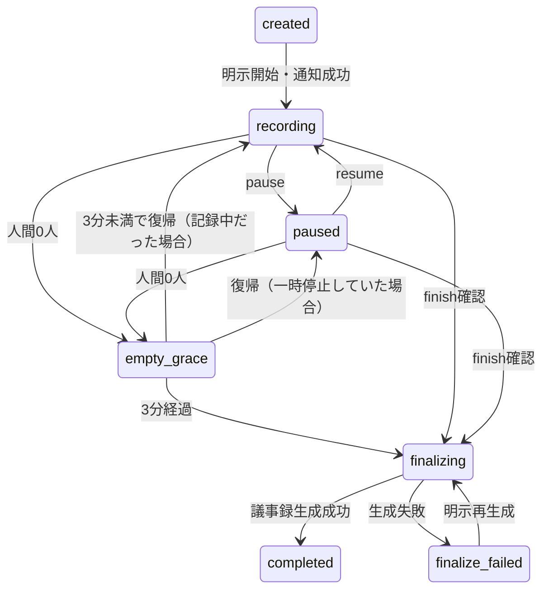

# 我ヶ谷：Discord版の仕様

更新日：2026年10月9日。改善実装ブランチのコードに対応する。稼働環境への反映と実通話の受け入れ確認は別作業である。

我ヶ谷は、会議の文字起こしと議事録の下書きを作るBotである。AIが声で会議に参加する機能は別設定になっており、既定は「議事録のみ」で音声発言しない。

## 1. 会議の開始と3モード

会議は人が `/waigaya start` を操作して始める。モードを省略すると選択画面を出し、選択するまでは記録しない。Bot起動・VC参加・再接続だけでは記録を始めない。

| 内部値 | 表示 | 自律音声 | askの音声 |
|---|---|---|---|
| `minutes` | 議事録のみ | 常にOFF | 常にOFF。文字回答のみ |
| `assistant` | 呼びかけた時だけ | OFF | `voice:true` の明示依頼時だけ |
| `facilitator` | AIワイガヤ | 条件を満たした時だけ | `voice:true` の明示依頼時だけ |

モード変更は同じ会議IDで行い、文字起こしや議事録を消さない。変更前の候補と再生中の音声は取り消す。議事録専用モードで直接再生APIを呼んでもTTSは起動しない。

対象は設定済みの1サーバー・通常のボイスチャンネル・同時1会議である。Stage・DM通話は対応しない。記録開始前にVCのチャットへ送信・保存先とモードを表示する。通知に失敗した場合は開始しない。

## 2. 操作と見える範囲

| コマンド | 動作 |
|---|---|
| `start` | 会議名・モード・任意の `output_channel` を選んで開始 |
| `status` | 記録状態、モード、経過時間、保存・障害・議事録・公開先を確認 |
| `mode` | モードを選択して変更。候補・再生を取り消す |
| `ask` | 依頼時点の会話への短い回答。既定は文字のみ |
| `summary` | 会議を続けながら、ここまでの根拠付き要約を生成 |
| `quiet` | AI音声・自律発言だけ停止。記録は継続 |
| `pause` | 新しい音声の送信を止め、送信済み区間を確定して記録を一時停止 |
| `resume` | 明示的に記録を再開。停止中の音声は後から送らない |
| `finish` | 60秒以内の確認ボタンで終了し、議事録下書きを生成 |
| `minutes` | 現在・最近の会議を選び、非公開で議事録・原本・JSONを取得。再生成・訂正・版の確認 |
| `publish` | 指定先・版を確認し、確認済みの議事録Markdownを共有 |
| `help` | 日常操作と送信・保存・公開範囲。開発・運用向け説明も選べる |

`start` のモード選択、日常操作、議事録プレビュー・添付は本人だけに表示する。記録開始通知はVCのチャットへ出す。AI音声は通話全員に届き、共有投稿は指定先の閲覧者に見える。

互換操作として `stop` はAIだけ停止、`auto enabled:true` はAIワイガヤへ明示切替、`auto enabled:false` はAI音声停止、`leave` は確認後の会議終了を残す。停止の意味は変えず、既定モードと確認手順の変更を操作ガイドで案内する。

## 3. 会議の状態と終了

人数は対象VCの人間だけを数える。Botは数えない。退出猶予は180,000ms。猶予中は新しい音声を記録しない。すでに送信した発話の確定結果は保存する。復帰時は同じIDを使い、一時停止中だった会議は勝手に録音を再開しない。

終了時は新規音声を遮断し、送信済みSTTの確定を最大13秒待つ。タイムアウトや強制切断は欠損の可能性を記録する。終了した会議はその状態を保持し、次の `start` は新しいIDを作る。

終了要求と生成中の処理を会議IDで管理し、手動終了・退出タイマーが競合しても生成を重ねない。議事録生成失敗は `finalize_failed` として再試行できる。正常終了と切断等の障害は `endReason`、`health`、`gaps` で区別する。

Bot再起動時は前回の記録中会議を一時停止へ、会議サーバー再起動時もDiscord会議を一時停止へ復旧する。生成途中でサーバーが停止した場合は生成失敗として再試行する。起動時の自動記録・環境変数による自動再開は廃止した。

## 4. 自律発言と古い候補の破棄

AIワイガヤだけが自律検討する。250msごとに条件を確認するが、毎回APIを呼ぶわけではない。

| 条件 | 値・動作 |
|---|---|
| 会話の増加 | 新しい対象発言3件、または合計60文字 |
| 対象発言 | 確定済み、空白・句読点等を除いて5文字以上、定義済み相づちを除く |
| 発話終了後の間 | 1.8秒 |
| 検討間隔 | 最短45秒 |
| 音声状態 | 人が発話中でなく、入力が正常である |
| 会議状態 | 記録中、人間がいる、ほかの回答・再生がない |
| 判断 | 整理・一つの質問・hold。holdも正常動作 |

自律要求は `autonomous`、手動回答は `reply` として分離する。新しい実質的な確定発言、根拠訂正、議題・段階変更、モード変更、停止で自律候補を取り消す。新しい会話があれば条件とクールダウンに従って再検討する。古い版の候補を読み上げ前にそのまま採用しない。

自律候補は根拠・文脈版・生成時刻・議題を保持し、生成後15秒で失効する。手動回答は依頼時点の会話に基づくことを表示し、通常の会話追加では取り消さないが、根拠訂正等で取り消す。手動回答の待機上限は60秒、再生前の間は1秒。

再生許可はサーバーの同じ同期制御で、最新文脈・根拠・入力・発話・モードを検査する。人の声を検知すると生成と再生を止め、旧世代の遅延音声を破棄する。残りの文は自動再開しない。

発話検知はRMS 0.006以上を60ms、終了は低音量300msを初期値とする。意味による割り込み判定ではないため、相づちや雑音でも停止し得る。発話が途切れてから回答までの総時間を1.8秒と保証するものではない。

## 5. 議事録と原本

SQLiteを正本とし、出力は別成果物に分ける。

| 成果物 | 内容 |
|---|---|
| `minutes-vN.md` | タイトル・実測日時・確認できる話者・概要・案・比較・人が確認した決定・決定候補・未決・行動案・記録注記 |
| `transcript.md` | 話者・時刻・確定／暫定・発言ID・revision、確認済み決定、AI再生履歴。訂正前の内容はイベント履歴に保持 |
| `minutes-vN.json` | `overview`、`ideas`、`comparisons`、`decisionCandidates`、`openIssues`、`actionItems`。各項目の根拠参照 |

議事録には専用のプロンプトとスキーマを使う。重要項目の根拠は人間の確定発言だけを許可する。AIの検出した決定は候補であり、人が記録した決定とは別に出力する。担当・期限は根拠発言に記載がなければ不明にする。空の会議ではAPIを呼ばず「会議内容なし」と表示する。

原発言を訂正すると旧根拠は要再確認となり、古い版を確認済み・共有にはできない。再生成と議事録本文の編集は新しい版を作る。議事録の確認は、その内容を読んだ操作担当者の確認であり、全員の合意や決定候補の承認ではない。

Discordのプレビューから原発言と議事録項目を訂正できる。長い原発言は4,000文字ごとの部分を選択して編集し、残りを保持する。訂正の送信前に原発言の版を検査する。議事録項目の直接編集は根拠を維持する。

## 6. 公開と権限

開始はVCの閲覧・接続権限を持つ参加者が操作できる。会議の操作・過去会議の閲覧・訂正・共有は開始者、Manage Server権限のある人、設定された管理ロールに限る。操作・閲覧時には元VCの閲覧・接続権限も確認する。記録操作では同じVCへの参加も必要である。

公開先は開始時に通常のテキストチャンネルを選ぶ。未指定なら全文の自動投稿はしない。開始時・投稿時に操作者の閲覧・投稿権限と、Botの閲覧・送信・添付権限を検査する。

終了後の案内は開始者へのDMであり、本文公開とは別である。DMに失敗しても `minutes` から取得できる。途中参加者にも送信・保存についてDMで知らせる。DMは閉じている場合もあり、必ず届くと保証しない。

公開前に最新の版を確認済みにし、`publish` で公開先と版を確認する。同じ会議・版・先の操作を重ねても投稿は一度だけ。送信前にSQLiteへ予約を保存し、送信後にメッセージIDを保存する。送信や結果保存に失敗した場合は予約を残し、再送しない。結果不明の予約を解除するUIは未実装で、運用者による照合が必要である。

## 7. 処理と長い会議

| 役割 | 場所・モデル |
|---|---|
| Discord接続・話者別受信・Opus復号・発話検知・再生停止・SQLite | ホスト端末 |
| 文字起こし | OpenAI `gpt-transcribe` |
| 議事録・進行の検討 | OpenAI `gpt-6.1-sol` |
| 音声生成 | OpenAI `gpt-4o-mini-tts`、既定の声 `marin` |

音声は48kHzステレオから24kHzモノラルPCMへ変換する。発話区間ごとにSTT接続を作り、準備中の音声は最大15秒分保持する。無音を常時送らず、同時発話は話者別に処理する。Discordの元音声をファイルとして保存しない。

議事録は約24,000文字の入力チャンクで整理し、根拠付きの途中要約を統合する。進行用文脈が90,000文字を超えた場合も、直近原文と長期の根拠付き未承認要約へ分ける。変更のない過去チャンクの要約は再利用し、使用量を保存する。モデルへの最終入力上限120,000文字は残す。統合が収束しない場合はエラーを返し、原本を切り捨てない。

SQLite内の全文は維持する。途中要約を人の確認済み事実として扱わない。専用の論点検索・全文検索UIは今後の課題である。

## 8. 接続保護と保存

Botと会議サーバー間には別の認証ファイルを使う。Discord会議のHTTP・WebSocket・Markdown・履歴・一覧は、ループバックからの認証済みBotだけに許可する。会議IDだけ知るLAN利用者やブラウザからは取得できない。旧Discord由来の記録も直接アクセスを拒否する。

ブラウザで作る独立会議は引き続き許可されたLANから利用する。Discordの会議をブラウザで閲覧する機能は提供しない。個人ログイン・会議単位のブラウザ認可は未実装である。

保存先は `data/waigaya.sqlite`。会議状態・発言・イベント・議事録版・確認者・公開予約と公開結果・使用量・欠損注記を保持する。自動削除や録音ファイル保存は有効にしない。保持期間と削除権限の管理UIは今後の課題である。

## 9. 失敗時の表示

| 失敗 | 動作・保存状態 |
|---|---|
| LLMの進行・回答 | 音声だけ失敗。文字起こしは継続 |
| TTS・Discord再生 | 音声だけ停止。文字起こしと議事録を巻き込まない |
| 話者別STT・復号 | 欠損の可能性を記録し、対象ストリームだけ再接続。連続失敗時は待ち時間を増やす |
| Discord接続・会議サーバー接続 | 正常終了と区別して停止。保存済みの発言を使って生成できる場合は生成する |
| 終了時STTの待機上限 | 欠損の可能性を記録して先へ進む |
| 議事録生成・統合 | 原本は削除せず、生成失敗を表示。再生成できる |
| SQLite保存 | 未保存の可能性を表示し、入力を停止。「保存済み」と表示しない |
| ファイル出力 | 原本は削除しない。出力の失敗を別に記録 |
| Discord案内・共有 | 送信の失敗を表示・記録。共有結果が不明なら二重送信を避ける |

モデル・上流接続の生の例外は利用者向け表示に使わない。秘密値・会議本文をログへ出さない。

## 10. 検証の範囲

95件の自動テストには、模擬Discordイベント、実ブラウザと模擬音声、状態遷移、停止・古い候補、再生成・根拠、認可、公開の冪等性を含む。実APIでは架空会話の議事録スキーマ・根拠参照を検証した。

今回の改善を反映した実Discordの2〜3人通話、全文再生、実権限、DM、添付・公開、3分退出猶予は手動受け入れ確認が残る。以前の版では2人分の文字起こしと再生開始・割り込み停止を確認したが、それを今回の全動作の実通話確認とは扱わない。

[設定と移行](discord-setup.md)／[変更一覧と残課題](docs/improvement-report.md)／[手動確認](docs/manual-acceptance.md)／[検証結果](docs/validation.md)
