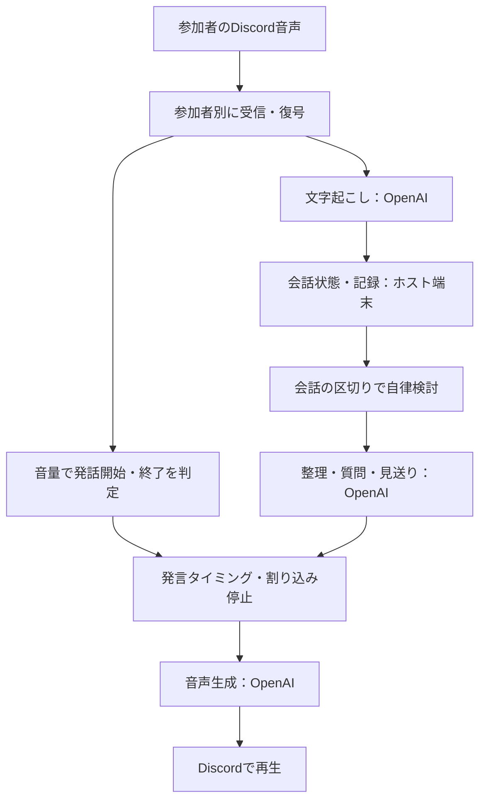

# 我ヶ谷：Discord版の現行仕様

更新日：2026年10月9日。現行コードと稼働設定を確認して作成した。対象はDiscord版のMVPである。

我ヶ谷は、ボイスチャンネルの会話を話者別に文字起こしし、会話の区切りで必要に応じて短い整理や質問を話すBotである。記録開始後は自律発言が有効になるため、通常の会話で毎回 `ask` を入力する必要はない。

操作と発言条件を先に示し、処理構成・保存内容・制限を後半に記載する。初期設定と起動手順は [Discord設定手順](discord-setup.md) を参照する。

## 1. 記録を始めると自律進行も始まる

| 項目 | 現行仕様 |
|---|---|
| Bot名 | 我ヶ谷 |
| 利用先 | 設定済みの1つのDiscordサーバー |
| 対応する通話 | 通常のボイスチャンネル |
| 同時に記録できる会議 | 1会議・1チャンネル |
| 開始方法 | ボイスチャンネルに入って `/waigaya start` |
| 自律発言の初期設定 | ON |
| 議題 | `topic` で指定。省略時は「Discord：チャンネル名」 |
| 議論の段階 | 新規会議では「整理（organize）」 |
| AIサービス | OpenAIのみ |

Botを起動しただけでは、新しい通話へ参加しない。`start` を実行した人の参加先へ入り、新しい会議IDを作る。記録中に別の会議を重ねて開始することはできない。

コマンドは、設定済みサーバー内で、Botと同じボイスチャンネルにいる人が操作する。専用の管理者ロールによる操作制限はない。通常のチャット本文やDMの内容は記録に取り込まない。

## 2. 開始・停止・再開をコマンドで操作する

| コマンド | 動作 |
|---|---|
| `/waigaya start` | Botを参加させ、文字起こしと自律進行を開始する |
| `/waigaya start topic:議題` | 最大160文字の議題を指定して開始する |
| `/waigaya ask` | その時点で確定している会話をもとに返答を依頼する |
| `/waigaya stop` | 読み上げと自律発言を停止する。文字起こしは続ける |
| `/waigaya auto enabled:true` | 自律発言を再開する |
| `/waigaya auto enabled:false` | 自律発言を停止する。文字起こしは続ける |
| `/waigaya leave` | 記録を終了し、Botを退出させる |

`stop` の後も、明示的に `ask` で返答を頼むことはできる。`auto enabled:true` は自律発言を再開する操作で、新しい会議は作らない。

開始時の案内と会議IDは、コマンドを実行したテキストチャンネルに表示する。`ask` の回答文と、停止・再開・退出の操作結果は、実行者だけに表示する。**ボイスチャンネルで流すAIの声は、通話の参加者に聞こえる。** Discordの「あなただけに表示されています」は文字の返信に対する表示である。

自律発言では、候補文をテキストチャットへ毎回投稿する処理はない。音声で発言し、生成結果や再生履歴を会議サーバーへ保存する。

## 3. 会話が増え、区切りができた時に検討する

自律進行の判定は250msごとに行う。次の条件がそろった時に、会話の整理や発言を考えるモデル（LLM）へ検討を依頼する。

| 条件 | 初期値・判定内容 |
|---|---|
| 自律発言 | ONであること |
| 入力状態 | 音声接続が正常であること |
| 参加者 | Bot以外の参加者が1人以上いること |
| 会話の区切り | 発話終了判定から1.8秒以上経過していること |
| 会話の増加 | 前回検討後の対象発言が3件以上、または合計60文字以上増えていること |
| 対象発言 | 確定済みで、空白・句読点などを除いて5文字以上。定義済みの相づちは除く |
| 検討の間隔 | 前回の自律検討開始から45秒以上経過していること |
| 他の処理 | AIが検討・返答待ち・再生中ではなく、手動の `ask` 処理中でもないこと |

3件・60文字の条件は、どちらかを満たせばよい。対象発言だけで件数・文字数を数える。「うん」「はい」「なるほど」「そうですね」などの相づちだけでは検討を始めない。この判定は文字数と定型表現を使うルールであり、意味を分類する専用モデルは使っていない。

45秒は検討開始の最短間隔である。毎回45秒後に話す仕様ではない。会話が増えない場合や、人が話し続けている場合は検討しない。LLMが発言を見送っても、その検討は1回として扱う。

再起動すると、Bot側の検討済み発言の管理と45秒の待機時刻は初期化される。運用側が既存会議へ再接続した場合、保存済みの会話も最初の検討対象になり得る。

## 4. AIは整理・質問・見送りを選ぶ

| 行動 | 用途 |
|---|---|
| `summary` | 論点や条件、意見の違いを短く整理する |
| `question` | 未決の条件などについて、一つ質問する |
| `hold` | 発言を見送る |

自律モードでは、人同士の議論が順調な時や、同じ整理をすでに伝えた時は見送るよう指示している。自律発言は120文字以内を目標とする。ただし、プログラムが厳密に検証する回答文の上限は240文字であり、120文字はモデルへの指示である。

再生完了の記録がある回答と、空白・句読点などを除いて同じ文になった場合は、自律モードで再び読み上げない。言い換えによる意味上の重複は、LLMへの指示で抑えている。

根拠は、確定済み発言のIDと版番号で検証する。存在しない発言、未確定の発言、訂正前の版を参照した回答は採用しない。この検証で確認するのは参照先の整合性であり、文字起こしや解釈の正しさそのものではない。

AIには、沈黙を合意と扱わず、決定・担当者・期限を推測で確定しないよう指示している。決定事項をDiscordの会話から自動登録する機能はない。

## 5. 回答を作る間も記録し、発言の間を待つ

検討には、開始時点で確定している発言を使う。生成中に新しい発言が増えても、通常は回答を取り消さずに記録を続ける。回答ができた後で人が話している場合は、次の区切りを待つ。

| 項目 | 現行値 |
|---|---|
| 自律発言の再生前の間 | 発話終了判定から1.8秒 |
| 手動 `ask` の再生前の間 | 発話終了判定から1秒 |
| サーバー側の最低条件 | 正常な音声入力、発話中ではないこと、発話終了後500ms以上 |
| 返答の待機期限 | 生成完了後60秒 |
| LLM APIのタイムアウト | 30秒 |
| 音声生成APIのタイムアウト | 30秒 |

1.8秒は検討や再生を始める条件であり、回答が1.8秒で返るという意味ではない。文字起こしの確定、LLMの生成、音声生成に別途時間がかかる。実APIの確認では、LLMの自律判断に約15.8秒かかった例がある。

確定済み発言の訂正、議題・段階の変更、明示的な停止、新しい依頼への切り替え、入力接続の消失では、古い返答を取り消す。文字起こしが遅れて追加・確定しただけでは、AIの返答や再生を止めない。

手動 `ask` に読み上げボタンは不要である。回答文を実行者に表示した後、条件を満たせば音声で返す。LLMが `hold` を選んだ場合は理由だけを文字で表示し、音声は出さない。

## 6. 人が話し始めたらAIの声を止める

音声の送信イベントだけで発話中とは判断しない。受信した音声波形の音量を使い、無音パケットによる誤判定を減らしている。

| 項目 | 初期値 |
|---|---|
| 発話開始 | 正規化した音量のRMSが0.006以上の状態が60ms続いた時 |
| 発話終了 | 閾値未満の音声が300ms続いた時、または受信区間が終了した時 |
| 複数人の発話 | 1人でも発話中なら、会議全体を発話中として扱う |

RMSは、音声波形の振幅から求める音量の指標である。発話開始を検知したら、LLMの判断を待たずにDiscordの再生を止め、生成音声も取り消す。停止後に届いた古い音声は再生しない。中断した文の残りを勝手に再開する処理はない。自律モードで再び発言が必要になった場合は、新しい会話をもとに改めて検討する。

現行の割り込み判定は音量に基づく。「うん」という相づちと「いや、違う」という訂正を意味で区別しないため、短い相づちでも条件を満たすと再生を止める。声量や環境音、スピーカーからの回り込みに対する調整は、実通話での確認が必要である。

## 7. 接続と記録はホスト端末、AI処理はクラウドで行う

参加者はPCやスマホのDiscordを使う。現在のホスト端末は、Bot・音声変換・会話状態の制御・記録保存を行う。モデルはOpenAIのAPIを利用し、端末上で推論しない。

| 処理 | 現行のモデル・方式 |
|---|---|
| 文字起こし | OpenAI `gpt-transcribe` |
| 整理・発言判断 | OpenAI `gpt-6.1-sol` |
| 音声生成 | OpenAI `gpt-4o-mini-tts` |
| 声 | `marin`（初期値） |
| 話者の区別 | Discordユーザーごとの音声ストリーム |
| 保存 | ホスト端末上のSQLite |

Discordのコマンドからモデルや声を切り替える機能はない。文字起こしには `gpt-transcribe` を使用し、LLMには会議サーバーが返す既定モデルを使う。

受信音声は48kHz・2チャンネルから24kHz・1チャンネルのPCMへ変換して文字起こしに送る。PCMは音声波形を数値として扱う形式である。生成音声は24kHz・1チャンネルからDiscordの再生形式へ変換する。

発話区間ごとに文字起こし接続を作り、接続準備中の音声は最大15秒分を一時保持する。受信が500ms途切れると区間を終了して確定を待つ。長い区間は文字起こし側で約12秒ごとに区切る。複数人の同時発話もそれぞれ認識する。

LLMへは、全ての確定発言、議題・段階、人が確認した決定、AIの再生履歴を送る。長い発言IDと話者名を依頼ごとの略記に置き換え、返った根拠を元のIDへ戻す。会話本文を黙って切り捨てる処理はない。送信JSONの上限は120,000文字であり、モデルのトークン上限とは別のアプリ側制限である。

## 8. 文字起こしと再生履歴を保存する

| 保存内容 | 内容 |
|---|---|
| 会議情報 | 会議ID、議題、段階、自律発言の設定 |
| 文字起こし | 発言本文、話者、確定状態、時刻、ID、版番号 |
| AIの生成結果 | 回答・理由・根拠などをイベント履歴へ保存 |
| 再生履歴 | 再生開始、完了・中断、端末が報告した再生経過時間 |
| 使用量 | 送信音声時間、LLMのトークン数など、取得できた値と費用の推定 |

保存先は `data/waigaya.sqlite`。話者名にはDiscordの表示名とユーザーIDを付ける。発言の時刻は、受信開始時刻と音声の長さから求めた目安である。

Discordの生音声を録音ファイルとして保存する機能はない。終了後も会議記録は残り、自動削除する期間は設定していない。

Markdownの記録は、会議サーバーの `/api/sessions/会議ID/markdown` で取得する。文字起こし、人が確認した決定、AIの再生履歴を出力する。Discordから記録ファイルを取得する専用コマンドや、過去のDiscord会議を選ぶWeb画面は未実装である。

再生開始や経過時間の記録は、参加者全員が文を最後まで聞いたことの証明にはならない。AIの発言を、人の発言や合意として扱わない。

## 9. 費用は送信音声と生成量で変わる

文字起こしの使用量は、参加者ごとの送信音声時間を合計する。同時発話があれば、通話の経過時間より合計が大きくなる場合がある。短いノイズや無音パケットも受信区間に含まれ得る。

自律検討は最短45秒間隔なので、定常的な呼び出し上限は1時間あたり約80回である。手動 `ask` はこの間隔の制限を受けない。見送りにもLLMの費用はかかる。

保存する費用は推定値であり、請求額と一致するとは限らない。音声生成や中断した生成など、費用が確定できないものは不明として扱う。実APIの確認では、165発言を含む1回の自律判断で推定$0.015474だった。この例は会議1時間の総費用を示すものではない。

## 10. 切断や失敗が起きた時の動作

| 状況 | 動作 |
|---|---|
| LLMの自律検討・返答待ちに失敗 | ログへ記録し、会議の文字起こしは継続する |
| 手動 `ask` に失敗 | 実行者へエラーを文字で表示する |
| 受信パケット・音声復号に失敗 | 該当ストリームを終了し、継続送信中なら再購読を試す |
| 音声再生に致命的なエラー | 現行処理では会議を終了し、Botが退出する |
| 文字起こしに失敗 | 現行処理では会議を終了し、Botが退出する |
| 会議サーバーとの接続消失 | 会議を終了する |
| Discord音声接続の切断・Botのチャンネル移動 | 会議を終了する |
| 全員が退出 | 自律検討を止めて待機する。自動退出はしない |

通常の退出では最後の文字起こしを最大13秒待ち、その後に接続を閉じる。障害や待機上限に達した場合は、最後の未確定発言を保存できない可能性がある。

ホスト端末の再起動後にBotを自動起動する設定はない。運用側が会議IDとチャンネルを指定して既存会議へ戻す処理はあるが、通常の `/waigaya start` は新しい会議を作る。

## 11. 実装済みの範囲と確認が残る点

| 項目 | 確認状況 |
|---|---|
| Bot認証・サーバー参加・コマンド登録 | 実Discordで確認済み |
| 通話参加・2人分の文字起こし保存 | 実Discordで確認済み |
| 再生開始・人の発話による中断 | 実通話と記録で確認済み |
| 自律判断・停止・文脈圧縮などの制御 | 57件のテストが通過。模擬応答を含む |
| 圧縮後の文脈による自律判断 | 165発言・入力13,840文字で実APIの正常応答を確認。結果は `hold` |
| 自律発言を参加者が最後まで聞けること | 修正後の実通話での確認が残る |
| 長時間・多人数での発言頻度と費用 | 評価が残る |

Stageチャンネル、DM通話、複数会議の同時進行、カメラ・視線の認識、外部検索、終了時の完成した議事録の自動生成は未実装である。短い相づちを音声で返す機能もない。極端に長い会議を段階的に要約して文脈上限を回避する処理は、今後の課題として残る。

動作に問題があった場合は、会議IDと発生時刻を使って `data/discord-bot.log` とイベント履歴を照合する。

## 実装の参照先

| 対象 | ファイル |
|---|---|
| 自律発言の条件 | [autonomy.js](src/discord/autonomy.js) |
| Discord参加・操作・受信 | [bot.js](src/discord/bot.js) |
| 返答待ち・再生依頼 | [bridge.js](src/discord/bridge.js) |
| 発話の判定・音声変換 | [audio.js](src/discord/audio.js) |
| 回答の採用・取り消し | [controller.js](src/controller.js) |
| モデルへの指示・文脈圧縮 | [models.js](src/models.js) |
| 記録保存・Markdown出力 | [store.js](src/store.js) |

実APIの確認結果：[検証記録の要約](docs/validation.md)。元の記録はローカルの `results/` に保存し、GitHubには含めない。
