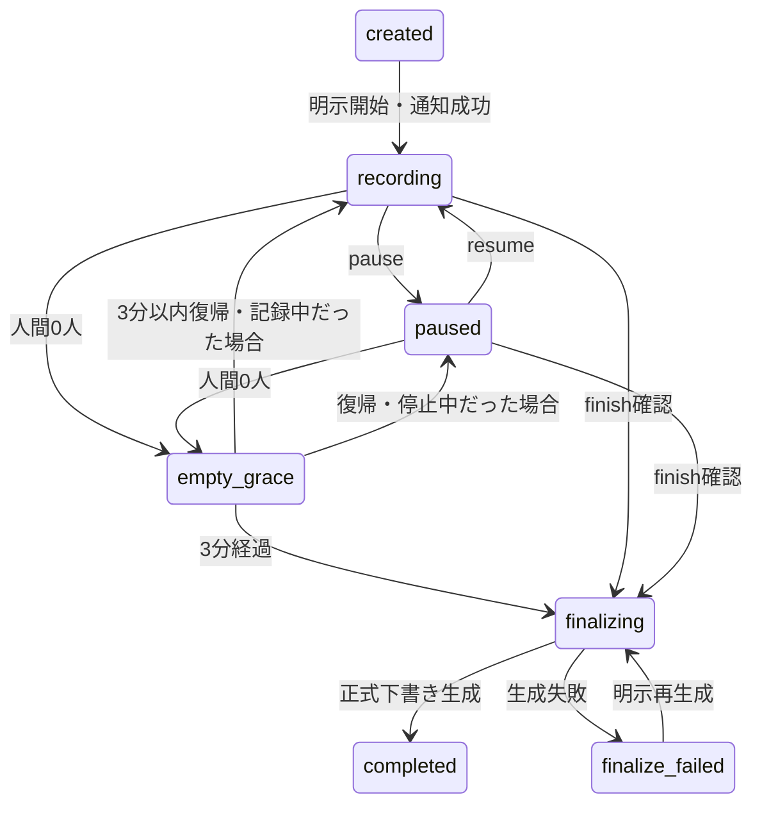

# 我ヶ谷：Discord版の仕様

更新日：2026年10月9日。PR #1の改善コードに対応する。本番適用と実通話確認は別のリリースゲートである。

## 開始・記録・AI発言

会議は人の `/waigaya start` で開始する。モード省略時は選択画面を出し、選択と送信・保存先の通知が済むまで記録しない。成功後はメニューを取り除き、別人・期限切れ・二重選択を拒否する。Bot起動・VC入室・再接続だけでは記録しない。

| モード | 記録 | AI音声 |
|---|---|---|
| minutes／議事録のみ（既定） | ON | 常にOFF。askも文字回答 |
| assistant／呼びかけた時だけ | ON | askでvoice:trueを指定した時だけ |
| facilitator／AIワイガヤ | ON | 条件とモデルの必要性判断を満たした時、または明示ask |

人が話している間はAI音声を始めず、人の声を検知したら生成・再生を止める。旧世代の後着音声を破棄し、残りを自動再開しない。モード変更・quietでも保留候補を取り消す。minutesでは直接の再生要求も拒否する。

記録開始前にVCのチャットへ、モード、OpenAIへの音声送信、ホストへの文字起こし・下書き保存、元音声を保存しないこと、保存先を通知する。通知できなければ開始しない。途中参加者へのDMは受信設定によって届かないためstatusでも状態を確認できる。

## 保存先と操作

| 操作 | コマンド・画面 |
|---|---|
| サーバー既定の保存先 | 管理者の `/waigaya setup channel:…`。clear:trueで解除 |
| 会議ごとの上書き | `/waigaya start output_channel:…` |
| 開始後の選び直し | `/waigaya destination channel:…` またはminutesの「保存先を選ぶ」 |
| 状態・障害・共有状態 | `/waigaya status` |
| モード変更・文字回答・途中要約 | mode／ask／summary |
| AIだけ止める | quiet。記録は継続 |
| 記録を止める／再開 | pause／resume。停止中の新しい音声は送らない |
| 会議終了 | finish → 60秒以内の確認 |
| 原本・議事録確認・訂正・取得 | minutes。最近の会議から選択できる |
| 確認と投稿 | minutesの「確認して投稿」→公開先・範囲・版を最終確認 |
| 確認済み版の互換共有 | publish →同じ最終確認 |
| 結果不明の照合 | 管理者のreconcile。投稿検索／投稿URL検証／未投稿確認 |
| 説明 | help。運用向け説明も選択できる |

保存先はフォーラム（GuildForum）を第一選択とし、通常テキスト（GuildText）にも対応する。開始時の明示指定＞サーバー既定＞未設定の順に選ぶ。既定変更は新規会議にだけ適用する。未設定でも下書きと非公開取得は使え、近くのチャンネルへ勝手に投稿しない。

操作・閲覧・訂正・投稿は開始者、ManageGuild権限のある人、明示設定した管理ロールに限る。元VCの閲覧・接続権限を検査し、記録操作は同じVCから行う。既定設定と送信結果の照合・再試行許可はManageGuild管理者だけに許可する。autocompleteでも許可のない会議のタイトルを返さない。

公開先では操作者の閲覧権限を要求する。操作者自身の投稿権限は要求せず、Botの閲覧・送信・添付権限を検査する。既存スレッドへの追記にはSendMessagesInThreads、照合にはReadMessageHistoryが必要。無断の別チャンネルへのフォールバックはない。

## 終了と復旧

人数は人間のみ。Botだけになったら180,000ms待ち、新しい音声を記録しない。送信済み発話の確定は保存する。戻れば同じ会議IDで続け、もともとpausedなら録音を再開しない。猶予を過ぎるとBotが退出し、終了・議事録生成を一度だけ行う。

終了はSTT確定を最大13秒待ち、未確定区間・切断・STT失敗は記録欠損の可能性として注記する。途中要約生成と競合した場合は、それを待った後に終了時点の原本で正式版を作る。終了済みの会議は再開せず、次のstartは新しいIDを作る。

再起動後のDiscord記録は一時停止に復旧し、resumeを待つ。録音を再開せずfinishで終了することもできる。生成途中で停止した場合は失敗として再生成できる。送信予約は照合待ちにし、起動時に投稿しない。

## 議事録の品質と版

SQLiteを正本とし、議事録Markdown、構造化JSON、文字起こし原本を分離する。重要項目には人間の確定発言のID＋revisionを付け、AI自身の発言を合意の証拠にしない。AIの決定候補と、人が記録した確認済み決定を分ける。担当・期限は根拠に記載がなければ不明。空会議は捏造せず、APIを呼ばない。

途中要約はkind:summaryと明示し、正式議事録として承認・投稿できない。既定の確認して投稿は会議終了後のkind:minutesだけに許可する。

原発言・議事録項目はDiscordから訂正できる。項目は25件ずつ全ページを選び、長い原発言は4,000文字ごとの部分を直す。原発言のrevisionと画面の版・実行者を検査する。訂正した根拠の旧版は要再確認となり、新しい版は未承認に戻る。確認済み本文と公開済み添付は後から書き換えない。

## 確認後のフォーラム投稿

会議終了だけでは公開しない。下書き完成は開始者へのDMで知らせ、DM不可でもminutesで取得できる。minutesの最終確認に、実際の保存先、親チャンネルを閲覧できる全員に見えること、正式版番号、タグ、短いプレビューを表示する。

最終確認で承認日時・承認者・本文を保存し、直後にBotが投稿する。別のpublish入力は不要。投稿失敗でも確認済み・未公開として原本と本文を残す。保存先や版が変わった古い確認画面では投稿しない。

- フォーラム：日付（Asia/Tokyo）＋確定した会議名のタイトルで1会議1投稿。短い本文と確認済みminutes-vN.mdを添付。版2以降は同じ投稿へ返信して添付を追記する。
- テキスト：親メッセージを投稿し、CreatePublicThreads／SendMessagesInThreadsがあればスレッドを作る。作れなければ親メッセージの成功を記録し、後の版を同じチャンネルへ追記する。
- タグ：既存の議事録・確認済みを使い、必須タグなら適用可能な既存タグを選ぶ。タグ新設やサーバー設定変更は行わない。必須タグを使えない時は設定案内を返す。
- アーカイブ・ロック：適切な権限またはBot自身の所有権のもとで再開。解除できない／削除されている場合は管理者の操作を案内し、新しい投稿を勝手に作らない。
- 長い本文は詳細を添付へ分ける。添付はUTF-8境界で分割し、10添付の容量を超えれば明確に失敗する。全文の黙った切り捨てはない。
- JSONと全文文字起こしは自動公開しない。allowedMentionsのparseを空にし、表示をエスケープして埋め込みも抑止する。会議・版・本文ハッシュ・予約の識別子を照合に使う。

フォーラム投稿は親フォーラムの閲覧者に見える。会議単位の非公開スレッドではない。機密性の異なる会議には、専用のアクセス制限された保存先を指定する。[Discord公式のスレッド権限](https://github.com/discord/discord-api-docs/blob/main/developers/topics/threads.mdx)、[フォーラムFAQ](https://support.discord.com/hc/en-us/articles/6208479917079-Forum-Channels-FAQ)

## 投稿結果の冪等性・照合

送信前に予約を保存し、成功時に保存先、thread ID、starter ID、版更新メッセージID、URL、確認済み本文、日時・担当を記録する。同一会議・版・保存先への連打、再送、再起動で二重投稿しない。

公開状態は下書き／確認済み・未公開／予約・処理中／公開済み／送信結果要照合／未送信確認済みを分けて表示する。Discordが未送信と明確に拒否した場合は修正後の明示再試行を許可する。タイムアウトや投稿成功後のDB保存失敗は要照合であり、無条件再送は禁止する。

管理者のreconcileはBot自身の投稿を検索し、会議・版・本文・予約を照合する。一致投稿は保存済みIDへ紐付ける。投稿URLも同じギルド・保存先・作者・識別子を検証する。旧予約は識別子がないため、URLを指定し、旧添付本文のハッシュを検証する。

未投稿の再試行許可には、完全な検索、送信から10分、管理者による「旧送信処理が停止・投稿を削除していない・未投稿」の確認が必要。検索は最大10ページ、候補100スレッドに制限し、上限・権限・APIエラーでは未投稿と扱わない。検索結果の不在だけでは過去の削除を区別できないため、管理者の確認を省略しない。

## 文脈・保存・配信

OpenAIのみを使い、STTはgpt-transcribe、議事録・進行はgpt-6.1-sol、TTSはgpt-4o-mini-tts。話者別の音声を受け、元音声を録音ファイルとして保存しない。自律の暫定条件は3発言または60文字、発話終了1.8秒、最短45秒の検討間隔。意味のある会話追加・訂正・モード変更で古い候補を取り消し、再生直前にも版・根拠・音声状態を検査する。

長い会議は約24,000文字で分割・統合する。進行入力が90,000文字を超えると直近原文と根拠付き未承認要約を使い、要約を再利用する。最終入力上限120,000文字は残し、収束しない時も原本を保持する。

SQLiteは発言・版・使用量等を個別行へ分離し、変更した行と軽い状態だけ保存する。原イベントは追記し、旧形式を追加テーブルへトランザクションで移行する。再生進捗は最大1秒ごとに保存し、完了・停止で最新値を確定する。クラッシュ直前の進捗は最大約1秒古くなり得るが、原発言・訂正・確認・投稿予約は間引かない。

WebSocketは初期・再同期時に全文、その後は項目差分を送る。順序が欠ければ再同期する。Botの追記APIは軽い受領確認を使い、通常HTTP APIの全文応答は互換性のため維持する。負荷測定は[検証記録](docs/validation.md)参照。

Discord会議のHTTP・WebSocket・ファイル・履歴はループバックからの認証済みBotだけに許可する。LANブラウザへ機密Discord会議を公開しない。独立したブラウザ会議の3モード・編集・終了・保存を維持する。自動削除と新しい外部連携は追加しない。

[操作・移行](discord-setup.md)／[差分・制約](docs/improvement-report.md)／[実通話チェック](docs/manual-acceptance.md)
