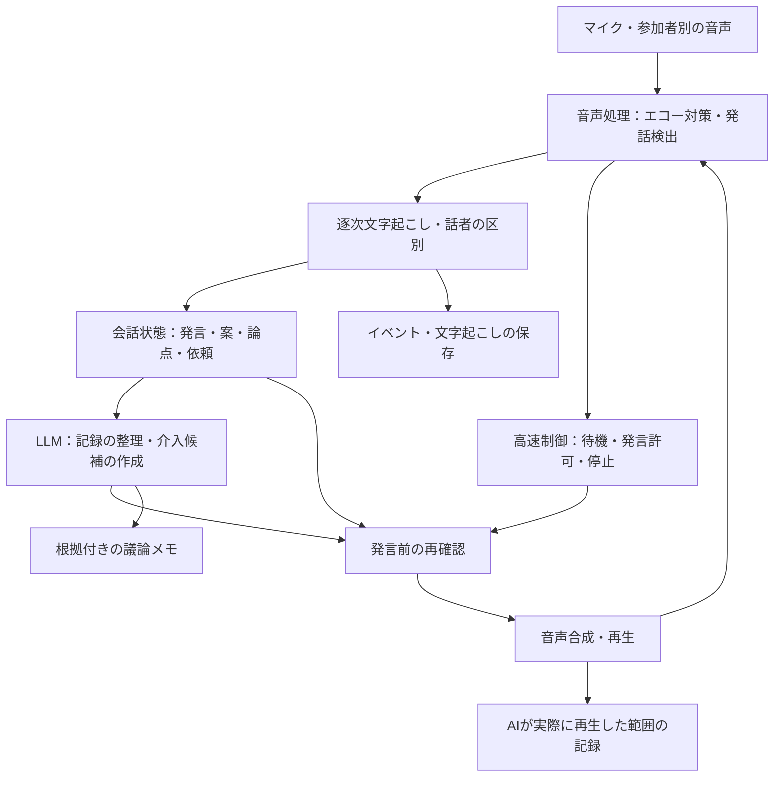

# ワイガヤのAI進行・記録係：会話を聞き続け、必要なときだけ発言する仕組み

> 設計・選定時の参考資料。現行Discord版の動作は [現行仕様](../discord-spec.md) を参照する。料金・提供状況は資料作成時点の記載である。

作成日：2026年10月7日／版：0.2／位置づけ：試作に向けた設計案

AIは音声を聞き続けて記録し、議論に役立つ問いや整理を用意する。その発言を実行する直前に、今も必要か、人の発言を遮らないかを確認する。**発言内容の検討と、発言・停止の制御を分ける**ことが、この設計の中心になる。

本資料は、音声入力から会話状態、介入判断、音声出力、記録までの具体的な仕組みを示す。数値は試作時の初期設定案であり、実測値や性能保証ではない。基本の記録・手動承認・音声入出力を実装済みで、自動介入や重なった声の判定は今後の対象である。人数、会議形態、機器は未確定である。音声と文字起こしはクラウドへ送信できる前提とする。

2026年10月8日追記：MVPはOpenAIのみで構成し、既存キーで接続を確認した。PCのブラウザで音声を取得・再生し、端末で停止を制御する。現時点の操作と制約は [README](../README.md)、モデルと費用は [モデル選定資料](ai-waigaya-models.md) を参照する。

LAN公開の追記：HTTPは `http://192.168.8.10:8765`、音声対応のHTTPSは `https://192.168.8.10:8766` で利用できる。別端末のマイク利用には証明書の信頼設定が必要で、HTTPの `/lan` に手順を用意した。

## 1. 人同士の会話が進んでいる間は記録を続ける

試作の説明には、3〜8人程度が一つのテーマを話し合う場を仮定する。人数は対応能力を示すものではない。参加者は自由に話し、人の進行役がAIの発言権限を設定する。開始時に記録の実施と保存先を共有する。

AIに任せるのは、発言の記録、案や未決事項の整理、具体例を引き出す質問、求められた要約である。自発的な相づちは初期設定で無効にする。個人への指名や、議論の段階の変更は、人の操作から始める。カメラやロボットの身振りは追加機能とし、音声だけで成立する構成を先に作る。

| 議論の段階 | AIが支援すること | 発言例 |
|---|---|---|
| 発散：案を広げる | 具体例、別の見方、条件を聞く | 「どんな場面で一番困りますか」 |
| 整理：案を比較する | 共通点、違い、未確認の点を示す | 「違いは導入費用と日々の手間ですね。どちらから確認しますか」 |
| 決定：選択を確認する | 決定内容と残る条件を確認する | 「試行するのはA案、費用は別途確認、という記録でよいですか」 |

段階は人が画面で指定する。AIが勝手に発散から決定へ移すと、案を広げたい時間を終わらせてしまう。

## 2. 音声制御と議論の検討を並行して動かす



音声処理から停止制御への経路に、LLMや確定文字起こしを挟まない。これにより、LLMが回答を作っている途中でも、人が話し始めたらAIの再生を止められる。音声出力から音声処理への矢印は、エコー対策に使う再生音声の参照を示す。

| 部品 | 入力と出力 | 担当する処理 |
|---|---|---|
| 音声入力・前処理 | 音声→時間付き音声片 | 音声取得、再生音声の混入対策 |
| 発話検出 | 音声→発話開始・終了 | 音声区間を検出するVAD。内容や話者の意図は判断しない |
| 文字起こし・話者区別 | 音声→暫定・確定発言 | 音声認識（STT）と話者ラベルの付与 |
| 状態管理 | 各イベント→現在の状態 | 発話中の人、発言履歴、論点、依頼を更新 |
| 記録・介入の検討 | 会話状態→整理結果・発言候補 | LLMによる意味の検討。直接再生は命令しない |
| 発言制御 | 候補＋現在の状態→待機・取消・再生 | 内容の有効性と発話の空きを確認 |
| 音声出力・保存 | 発言文→合成音声・再生履歴 | 音声合成（TTS）、再生、取消、記録 |

## 3. 音声入力は会議形態に合わせて取り替える

対面ではUSB会議マイクとスピーカー、オンラインでは会議システムから許可された参加者別音声を使う構成が考えられる。利用する機器や会議サービスで、どの音声を取得できるかは別途確認する。

| 入力形態 | 設計上の扱い |
|---|---|
| 対面・一つのマイク | 話者を声から推定する。重なった発言や話者不明を許容し、個人別の発言量は参考表示に留める |
| オンライン・参加者別音声 | 音声チャネルを話者の手掛かりにする。同じ端末を複数人が使う場合は個人を確定しない |
| 混在 | オンライン音声と会議室音声の時間を合わせ、同じ音声の二重取り込みを防ぐ |

対面でAIの音声をスピーカーから出す場合、再生音声を参照してマイクに戻った音を抑える処理、AECを検討する。AIが話している間にマイクを無効にする方法では、人の割り込みも検出できなくなる。

試作では、AIだけが話している場面と、人がAIに重ねて話す場面の両方で確認する。音量、スピーカー位置、残響によって自己音声の誤検出が残る場合は、候補表示モードに戻して機器・音声処理を調整する。

## 4. 音声の状態と議論の状態を別々に持つ

状態管理は、一つの処理でイベントを順番に適用し、他の部品に読み取り用の状態を渡す。LLMに渡すのはその時点の写しであり、LLMの処理中も状態の更新を続ける。

| 音声制御の状態 | 内容 |
|---|---|
| `active_channels` | 発話中の音声チャネル。個人が分からなくても更新する |
| `overlap_detected` | 複数の発話が重なっているか。不明も表現する |
| `silence_ms` | 人の発話が検出されていない時間 |
| `input_healthy` | 入力が継続して届いているか。入力停止を沈黙と誤認しない |
| `ai_playback` | 再生中か、再生ID、実際に再生した位置 |
| `output_epoch` | 音声出力の世代番号。停止後に届く古い音声片を破棄するために使う |

| 議論の状態 | 内容 |
|---|---|
| `topic_id / phase` | 現在の論点と、発散・整理・決定の段階 |
| `utterances` | 発言ID、時刻、話者、本文、暫定・確定、修正番号 |
| `issues / ideas` | 論点、案、理由、懸念、未確認事項と根拠発言ID |
| `open_requests` | 「ここまで整理して」など、応答が必要な依頼 |
| `candidate` | 一つの発言候補、対象論点、根拠、有効期限、候補の状態 |
| `last_ai_end_at` | 自発的な介入の間隔を管理する時刻 |
| `control_mode` | 記録のみ／候補表示／呼びかけ応答／自動介入 |
| `context_revision` | 発言内容、論点、段階、権限の変更で進む版番号。無音時間などの更新とは分ける |

「相づち」「考え中」「同意」などの解釈は観測事実と分ける。発言が少ないことや視線だけから、その人の意欲・感情・理解度を確定しない。

## 5. 暫定文字起こしは上書きし、根拠の修正を追跡する

発言イベントには、少なくとも次の項目を持たせる。

```json
{
  "event_id": "e-104",
  "type": "transcript_final",
  "utterance_id": "u-21",
  "revision": 2,
  "start_ms": 12400,
  "end_ms": 15900,
  "received_ms": 16300,
  "channel_id": "room-mic",
  "speaker_id": null,
  "text": "最初は少人数で試したい",
  "source": "human",
  "quality": "speaker_unknown"
}
```

時刻はセッション開始からの経過時間を使い、表示用の日時も別に保存する。発言の順序は受信時刻だけで決めず、音声の開始・終了時刻を使う。時計が異なる入力は時間を合わせる。

同じ発言IDの暫定結果は、新しい修正番号で置き換える。「少人数で」「少人数で試したい」を二つの独立した意見として数えない。保存するイベント履歴は残し、現在の文字起こしを再構成できるようにする。

確定後も話者や本文が修正される場合がある。その発言を根拠にしたメモと候補を再確認し、必要なら修正・取消する。読み取れない箇所は不明として残す。重なった音声を一つの明確な賛成意見に補完しない。

## 6. 介入は根拠のある候補から選ぶ

介入の検討は、確定発言の追加、依頼の検出、論点・段階の変更、沈黙が一定時間続いたときに起動する。LLM呼び出しは一つずつ実行し、処理中に入った更新は次の検討にまとめる。音声イベント自体は間引かずに保持する。

最初は規則で検討対象を絞り、LLMが発言履歴を読んで候補を作る。沈黙の長さだけで発言を実行しない。

| きっかけ | 検討する条件 | 生成する候補 |
|---|---|---|
| 明示的な依頼 | AIへの呼びかけ、または画面操作で確認できる | 依頼への短い応答 |
| 論点の繰り返し | 例：同じ論点の直近6発言中、3発言が同じ未確認事項に戻る | 違いの整理、確認すべき点への質問 |
| 抽象的な議論 | 問題や案はあるが、根拠となる具体例が記録されていない | 一つの具体例を聞く |
| 長い沈黙 | 未決の問いがあり、発話の途中ではなく、入力も正常 | 言い換えや別の切り口。判断が不明なら待つ |
| 時間の区切り | 参加者が設定した時刻に到達する | 続けるか整理するかを聞く |

繰り返しの数え方や「抽象的」の判定は試作で検証する。異なる意見が同じ単語を使っただけで、堂々巡りと判断しない。

LLMには、議論の段階、直近の確定発言、根拠付きの論点メモ、未処理の依頼を渡す。長い会議では、過去全体を毎回渡す代わりに、現在の論点に関係する発言をIDで取り出せるようにする。

候補の出力形式は次の例に固定する。LLMの出力をそのまま実行せず、項目、参照ID、文章量を検査する。

```json
{
  "action": "ASK_EXAMPLE",
  "topic_id": "topic-2",
  "request_id": null,
  "evidence": [{"utterance_id": "u-21", "revision": 2}],
  "reason": "導入の難しさについて具体的な場面がまだ出ていない",
  "text": "導入が難しかった場面を、一つ挙げるとしたら？",
  "resolved_if": "同じ論点で具体例が提示された"
}
```

LLMへの指示は「発言しない選択を許す」「質問は一度に一つ」「根拠IDを必須にする」「人の意見とAIの提案を区別する」「合意を推定しない」とする。発言文はまず1〜2文に収め、必要なら追加説明は参加者の依頼を待つ。

## 7. 発言候補は期限と根拠を持ち、再生直前に確認する

制御側は候補に作成時刻、有効期限、根拠の修正番号を付ける。候補は一つだけ保持し、明示的な依頼への応答を自発的な質問より優先する。

| 候補の状態 | 次の処理 |
|---|---|
| `PROPOSED` | 内容を検査し、表示または発言待ちにする |
| `WAITING` | 発言できる空きを待つ。必要性を再確認する |
| `PLAYING` | 実際の音声再生を追跡し、人の発話を監視する |
| `COMPLETED` | 再生完了を記録する |
| `CANCELLED` | 論点変更、解消、期限切れなどの理由を記録する |
| `INTERRUPTED` | 再生した範囲を残し、残りを自動再開しない |

再生の条件は、入力が正常、人が話していない、重なりがない、発言権限がある、必要な無音区間がある、候補が現在も有効、のすべてが成立することとする。

新しい発言や根拠の修正が入ったら候補を再確認する。その間は再生を許可しない。LLMによる再確認中も更新が入るので、再生直前に、確認に使った `context_revision` と現在の値を照合する。音声の状態はその時点の最新値で確認し、競合時は待機に戻す。

自発的な候補が期限切れになったら捨てる。明示的な依頼への回答が古くなった場合は、依頼を未処理のまま保持し、最新の内容で作り直す。候補の取消を、依頼の処理完了と混同しない。

## 8. 人が話し始めたら、音声生成と再生の両方を止める

高速制御は、LLMの処理とは別に動かす。以下は制御の順序を示す擬似コードであり、実行可能な実装ではない。

```text
音声イベントを受け取る:
    音声の現在状態を更新する
    入力異常なら、AI再生を停止し、自動発言を無効にする
    人の発話開始なら:
        発言許可を取り消す
        AI再生中なら:
            出力の世代番号を進める
            音声生成を取り消し、再生バッファを破棄する
            再生位置と中断理由を記録する
        未再生の候補を再確認待ちにする

発言を試みる:
    候補の内容・期限・権限・会話の版を確認する
    人の発話、入力異常、必要な無音区間の不足なら待つ
    最終確認と再生開始を同じ制御処理内で行う
    現在の世代番号を付けて音声出力を開始する

音声片が届く:
    世代番号が古ければ破棄する
    再生が許可されている場合だけ再生する
```

停止命令の後でも、通信中の音声片が遅れて届くことがある。生成の取消だけでなく、出力の世代番号の確認と、再生バッファの破棄が必要になる。既に機器へ渡した音声は即座に消せないため、出力バッファを小さく保ち、停止時間を実測する。

試作では短い「うん」も停止の対象とする。相づちと割り込みを区別して話し続ける機能は、複数人での誤判定を確認してから追加する。

### 時間の設定は検証可能な仮説として置く

| 項目 | 初期設定案 | 意図 |
|---|---|---|
| 高速制御の確認間隔 | 50ms、または音声イベントごと | 停止をLLMの応答待ちにしない |
| 発話開始の確定 | 音声らしい区間が約120ms続く | 短い物音による誤停止を減らす |
| 割り込みから停止まで | 人の声の開始から300ms以内を目標 | 検出・伝送・再生バッファを含めて測る |
| 発言前の無音 | 自発的介入1,000ms、依頼への応答500ms | 人の発言交代を待つ。文字起こし未確定なら追加で待つ |
| 沈黙を検討する時点 | 4秒 | 未決の問いがある場合に候補の検討を始める |
| 自発的介入の間隔 | AI再生終了から45秒以上 | AIの発言過多を抑える。明示的な依頼は対象外 |
| 候補の有効期限 | 自発的介入5秒、依頼への応答15秒 | 古い発言を防ぐ。待機中も期限は進む |

発話途中の間や、考える沈黙を守るには、無音時間に加えて、直前の文が続きそうかも確認する。判断が曖昧なら待つ。短い応答でも文字起こし・LLM・音声合成の時間は別にかかり、表の値で応答速度が保証されるわけではない。

## 9. 記録は発言、整理、確認済み事項をつなげて保存する

保存対象を三つに分ける。後から整理内容を訂正できるように、元の発言への参照を残す。

| 保存対象 | 主な項目 | 更新の方法 |
|---|---|---|
| 発言・イベント履歴 | 音声時刻、発言ID、修正番号、話者、本文、取得品質 | 原イベントを追加し、最新の文字起こしを再構成する |
| 議論メモ | 案、理由、懸念、未決の問い、根拠ID、AIによる整理かどうか | 根拠の修正に応じて更新し、変更履歴を残す |
| 決定・行動事項 | 内容、確認者、確認方法、根拠、担当者、期限 | 人の確認を受けて確定する。担当者・期限が不明なら空欄にする |

「反対が聞こえなかった」は合意の証拠にしない。初期版では、画面で人が決定事項を確認したものだけを確定する。進行役の決定と全員の合意は確認方法を分け、会議ごとに誰が決定できるかを設定する。

AIの発言は、生成文と実際の再生履歴を分けて保存する。中断時は再生時間・位置を記録し、全文を参加者に伝達済みと扱わない。文中のどこまで聞こえたかを精度よく復元できない場合は「途中で中断」とする。

最小構成では、追記型のイベントファイルと、検索・表示用のSQLiteを使う案がある。音声を残す場合は発言時刻から参照できるようにする。保存範囲、保存期間、参加者が修正できる項目はセッション設定に持たせる。

## 10. 会話が進んだら候補を取り消す

以下は動作を説明するための想定例であり、実際の会議で取得したログではない。

| 時刻 | 人の会話・処理 | AIの状態 |
|---|---|---|
| 0.0秒 | A「導入が難しいんですよね」 | 記録を更新する |
| 0.8秒 | LLMが具体例を聞く候補を作成する | 発言前の無音を待つ |
| 1.0秒 | B「前の導入では、設定に半日かかって…」 | 発話開始で許可を取り消す |
| 1.7秒 | 暫定文字起こしで具体例らしい内容が見える | 再確認待ちにする |
| 3.5秒 | Bの発言が確定する | 問いが解消されたので候補を取り消す |
| 4.0秒 | A「そう、その設定作業が問題なんです」 | 人同士の会話を記録する |

一方、参加者が「AI、ここまで整理して」と呼びかけた場合は、依頼として保持する。内容の確定と無音区間を確認して短い整理を再生し、人が補足を始めたら停止する。中断された依頼を完了にするか、追加応答が必要かは、続く発言や人の操作で確認する。

## 11. 試作は候補表示から始め、発言制御を段階的に確かめる

| 試作段階 | 作るもの | 次へ進む判断材料 |
|---|---|---|
| A：記録＋候補表示 | 音声入力、逐次文字起こし、根拠付きメモ、候補の表示・取消、訂正画面 | 候補が役立つか、取消が適切か、記録の根拠を追えるか |
| B：人が選んだ候補を発言 | 音声合成、発言前確認、割り込み停止、再生範囲の記録 | 人の選択後に会話が進んでも、古い候補を再生しないか |
| C：呼びかけ応答＋限定的な自動介入 | 依頼の管理、段階別の規則、期限・介入間隔の設定 | 明示的依頼への応答と自発的介入を分けて評価できるか |

画面には文字起こし、論点メモ、発言候補を表示し、操作として「この候補を発言」「取り消す」「AIの音声を止める」「議論の段階を変更」「決定事項を確認」を置く。候補には作成理由と根拠を表示する。人が選択しても発言前の再確認は省かない。

実装の部品は音声入力、音声認識、LLM、音声合成を取り替えられる形にする。停止制御とイベント保存は独立させる。外部サービスが使えないときは、自動発言を止め、可能な範囲で音声・イベントの記録を続ける。入力断や保存失敗は画面に示し、記録できていると誤表示しない。

## 12. 評価は発言量より、役立ち方と妨げ方を見る

まず録音から候補生成・取消を再現して確認し、その後、実際の機器で人の割り込みと停止を検証する。録音の再生だけでは、生の発言タイミングやスピーカーの回り込みは評価できない。

| 評価項目 | 測り方 |
|---|---|
| 不要な介入 | 参加者が不要と評価した自発的介入数／評価した自発的介入数 |
| 質問の有用性 | 参加者の評価と、質問後に具体例や新しい論点が出たかを記録する |
| 人の発言との重なり | AI発言開始時に人が既に話していた件数。後から人が割り込んだ場合は別に数える |
| 停止時間 | 人の発話開始からAIの音が止まるまで。中央値と95パーセンタイルを示す |
| 古い候補の再生 | 解消、論点変更、根拠修正、期限切れの後に再生した件数 |
| 記録の誤確定 | 人が確認していない内容を決定事項として確定した件数 |
| 訂正の反映 | 本文・話者の修正後、関係するメモと候補が更新されたか |

AIがよく話すことを成功とはしない。候補表示の段階で参加者の判断を集め、会議の目的に合った評価基準を決める。停止時間の目標以外の数値基準は、初回の測定結果を見て設定する。

重点確認シナリオは、①思考中の沈黙、②人同士の相づち、③二人の同時発話、④AI再生中の割り込み、⑤LLM処理中の論点変更、⑥文字起こしの訂正、⑦期限切れの明示的依頼、⑧AIの自己音声、⑨入力断、⑩取消後に届く音声片、とする。

## 13. Griffinの考え方を参考にし、制御の仕組みは自分たちで設計する

Griffin公式資料は、音声・映像を入力し、秒未満の間隔で会話状態を評価して、AIの発言中も認識を続ける構成を説明している。公式図にも、発言・保留・発言権の譲渡（speak / hold / yield）、割り込み時の継続・一時停止・停止が記載されている。本資料の状態名やデータ形式は、Griffinの公開API仕様ではなく、ワイガヤ用の独自案である。[Tavus：Griffin公式説明](https://www.tavus.io/griffin)

公式資料が示す会話モデルと生成系の構成を、本資料では、音声の高速制御とLLMによる議論の検討に分けて実装する案へ置き換えた。公開資料から、同じ内部実装を採っていると断定はしない。

MiniCPM-o 4.5は公式リポジトリで、音声・映像の入力と音声出力を並行して行う全二重のライブ処理を説明している。将来の音声・映像統合の検討対象にはなるが、複数人の日本語ワイガヤへの適合性は別に評価する。[OpenBMB：MiniCPM公式リポジトリ](https://github.com/OpenBMB/MiniCPM-V)

Moshiの公式リポジトリも、全二重の音声対話とRust等の推論実装を公開している。聞きながら話す構成の参考にはなるが、議論の段階、候補の取消、決定事項の確認は別の制御として必要になる。[Kyutai：Moshi公式リポジトリ](https://github.com/kyutai-labs/moshi)

参照確認日：2026年10月7日。資料中の設計例・時間設定・評価方法は本提案であり、上記製品の仕様や検証結果ではない。

## 14. 最初に確かめるのは音声入力と、発言候補の質である

PCとUSB会議用スピーカーフォンを使い、音声入力・割り込み停止を端末内、議論の検討をクラウドに置く案を採る。スマホ、Jetson、完全ローカルとの比較は、[デバイス・処理配置の設計資料](ai-waigaya-devices.md)に記載した。

まず一回のワイガヤで、人が実際に採用した候補、不要だった候補、取消が間に合わなかった候補を集める。その結果を使って介入条件を調整し、同じ音声入力で割り込み停止を確認してから、自動発言の範囲を広げる。
